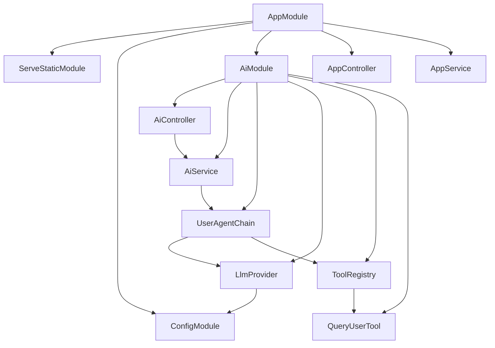

# Cron Job Tool

`cron-job-tool` is a NestJS application that exposes an AI chat endpoint backed by a LangChain tool-calling agent. The current domain is intentionally small: the agent can call a `query_user` tool to look up sample user records and then produce a natural-language answer.

## Architecture Assessment

The overall architecture is reasonable for the current stage:

- `AppModule` acts as the application composition root. It wires static assets, environment configuration, and the AI feature module.
- `AiModule` owns the AI feature boundary. HTTP handling, orchestration, model selection, prompts, tools, and agent state stay inside `src/ai`.
- `AiController` is thin and delegates business flow to `AiService`.
- `AiService` owns the small amount of invocation orchestration needed today: initial state, iteration limit, and final answer extraction.
- `UserAgentChain` only defines the LangChain prompt/model/tool chain.
- `ToolRegistry` centralizes which tools are available to each agent.
- `LlmProvider` isolates model creation and tool binding from the rest of the feature.

The main improvement made here is that `query_user` is now represented by an injectable Nest provider (`QueryUserTool`) instead of a module-level exported tool constant. This keeps the tool compatible with future dependencies such as repositories, database clients, cache services, or external APIs.

## Module Relationship



## Request Flow

1. A client sends `GET /ai/chat?query=...`.
2. `AiController.chat()` receives the query and calls `AiService.runChain()`.
3. `AiService` creates the initial agent state and gets the chain from `UserAgentChain`.
4. `UserAgentChain` fetches tools from `ToolRegistry`.
5. `LlmProvider` creates the chat model and binds those tools.
6. `createUserAgentPrompt()` creates the system prompt and message placeholder.
7. `createToolCallingAgentChain()` defines one agent step:
   - ask the model for a response;
   - if the response has tool calls, execute matching tools;
   - append tool results to the message list;
8. `AiService` invokes the step chain repeatedly until the model returns a final answer or the iteration limit is reached.
9. The final answer is returned as `{ "answer": "..." }`.

## Directory Guide

```text
src/
  app.module.ts                 Application composition root
  main.ts                       Nest bootstrap
  ai/
    ai.controller.ts            HTTP API for AI interactions
    ai.service.ts               Application-facing AI use case
    ai.module.ts                AI feature module
    chains/                     LangChain chain definitions and factories
    entities/                   Type-only domain and chain state definitions
    models/                     LLM creation and tool binding
    prompts/                    Prompt factories and prompt constants
    tools/                      Agent tool providers and tool registry
public/
  sse-test.html                 Static browser test page
```

## Environment

The app loads environment variables from `.env.${NODE_ENV || 'local'}` via `ConfigModule`.

Expected values:

```bash
OPENAI_API_KEY=...
MODEL_NAME=...
BASE_URL=...
PORT=3000
```

`BASE_URL` is optional when using the default OpenAI endpoint.

## Commands

```bash
pnpm install
pnpm run start:dev
pnpm run build
pnpm run test
```

## Extension Guidelines

- Add a new tool as an injectable provider in `src/ai/tools`.
- Register the new provider in `AiModule`.
- Expose it through `ToolRegistry` rather than importing tool constants directly into chains.
- Keep controllers thin; use services for light orchestration.
- Keep `chains/` focused on chain definitions and factories; do not put request invocation loops there.
- Keep provider dependencies flowing inward through Nest injection instead of module-level singletons.
- Add a dedicated runner layer only when orchestration grows beyond what `AiService` can clearly hold.
